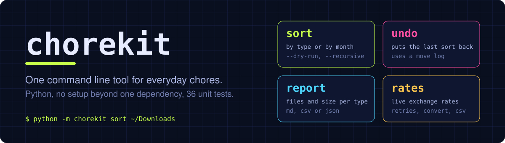
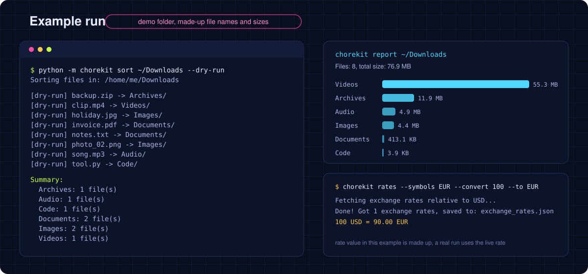

# chorekit

A command line toolkit for everyday chores, written in Python. Sort a messy folder by file type or month and undo it if you change your mind, get a report of what takes the space, and download current exchange rates.

## Commands

- `sort`: moves the files of a folder into subfolders, by file type (Images, Documents, Videos, Audio, Archives, Code, Others) or by modification month (`2026-03`). Supports `--dry-run` and `--recursive`. If a name is already taken, the file becomes `name_1`, `name_2`, and so on.
- `undo`: puts the files from the last `sort` back where they were and removes subfolders that became empty.
- `report`: counts files and their size per category and lists the largest files. Output as Markdown, CSV or JSON.
- `rates`: downloads current exchange rates from the free `open.er-api.com` API (no API key). Retries on network errors, can keep only some currencies, convert an amount, and save as JSON or CSV.

## Install

```
git clone https://github.com/vantacorehq/chorekit.git
cd chorekit
pip install -r requirements.txt
```

Run it from the repository folder:

```
python -m chorekit --help
```

## Usage

Sort a folder. Look at the plan first, then do it, then undo if needed:

```
python -m chorekit sort "C:/Users/Me/Downloads" --dry-run
python -m chorekit sort "C:/Users/Me/Downloads"
python -m chorekit undo "C:/Users/Me/Downloads"
```

Other ways to sort:

```
python -m chorekit sort ~/Downloads --by month
python -m chorekit sort ~/Downloads --recursive
```

Report on a folder:

```
python -m chorekit report ~/Downloads
python -m chorekit report ~/Downloads --recursive --top 10 --format csv --output report.csv
```

Exchange rates:

```
python -m chorekit rates
python -m chorekit rates --base EUR --symbols USD,GBP,PLN --output eur_rates.json
python -m chorekit rates --convert 100 --to EUR
python -m chorekit rates --format csv
```

`rates` options: `--base` (default `USD`), `--symbols`, `--convert` with `--to`, `--format` (`json` or `csv`), `--output` (default `exchange_rates.json` or `exchange_rates.csv`), `--retries` (default `3`), `--backoff` (default `1.0` seconds, doubles after each retry).

`report` options: `--recursive`, `--top` (default `5`), `--format` (`md`, `csv` or `json`, default `md`), `--output`.

## How it is built


## Example run



The picture shows a demo folder with made-up file names and sizes. The exchange rate in the example is made up too: a real run uses the live rate.

## Good to know

- `sort` moves files, it does not copy them. Use `--dry-run` first on an important folder.
- `sort` writes a log (`.chorekit_moves.json`) into the sorted folder. `undo` reverts only the last sort. Files that are gone, or whose original place is taken again, are skipped and reported.
- With `--recursive`, files from subfolders are moved into the category folders of the target folder. Already sorted folders directly inside it (`Images`, `Documents`, `2026-03`, ...) are left alone.
- `--by month` uses the file modification time.
- `rates` retries connection errors, timeouts, HTTP 429 and HTTP 5xx. Other HTTP errors fail right away. It needs internet access and depends on the public API being available.
- The CSV report has the columns `category`, `files`, `bytes`. The JSON report also includes the largest files.

## Tests

```
python -m unittest discover -s tests -t .
```

36 tests cover sorting, undo, reports, rate fetching with retries (network calls are mocked) and the command line. Tested with Python 3.12.

## Project layout

```
chorekit/
  cli.py          command line arguments and commands
  sorter.py       sort and undo
  report.py       folder report
  rates.py        exchange rates
  categories.py   file extensions per category
tests/            unit tests
assets/           images for this README
```

## License

MIT, see [LICENSE](LICENSE).

## Need custom automation?

Open for freelance work: automation and scripting projects. DM me on X: [@vantacorehq](https://x.com/vantacorehq)
    
    

    

   


 
